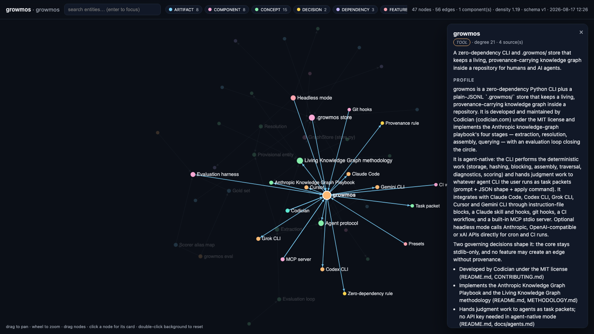

# growmos

<p align="center">
  <a href="https://pypi.org/project/growmos/"></a>
  <a href="https://github.com/codician-team/growmos/actions/workflows/ci.yml"></a>
  
  <a href="LICENSE"></a>
  
</p>

**A living knowledge graph that grows with your repo.**
Shared, provenance-carrying memory for humans and AI agents — plug & play with Claude Code, Codex, Grok, Cursor, Gemini, or any MCP-capable CLI. Zero dependencies. MIT.

> *"Each agent's memory dies with its context window."* growmos is the layer underneath: the
> durable, queryable world model that lets today's session pick up where yesterday's left off —
> and lets five agents share one picture of the codebase without passing it through anyone's
> context window.

Built by [Codician](https://codician.com) as an open, tool-agnostic implementation of the
knowledge-graph methodology described in *Knowledge Graph Engineering for Multi-Agentic Systems:
The Anthropic Playbook* (extraction → resolution → assembly → querying, with an evaluation loop
closing the circle). See [METHODOLOGY.md](METHODOLOGY.md) for the full methodology.

```
   docs, ADRs, READMEs, sessions ──▶ 1. Extraction ──▶ 2. Resolution ──▶ 3. Assembly ──▶ 4. Querying
                                     (agent packet)    (agent packet)    (deterministic)  (grounded answers,
                                                                                            edge citations)
                     ▲                                                                            │
                     └──────────────── growmos remember / link / journal  ◀── agents develop ◀────┘
                                       evaluation loop: change prompt → growmos eval → watch F1 move
```

<p align="center"></p>
<p align="center"><code>growmos view</code> — after a few days of development, this is what lays in your graph: hubs sized by degree, colored by type, every edge with provenance, profiles on click.</p>

## Why

Multi-agent systems and long-running coding sessions share one weakness: memory dies with the
context window. RAG surfaces chunks but cannot *chain* facts. A knowledge graph — entities as
nodes, short-verb-phrase relations as edges, every edge carrying provenance — turns multi-hop
questions ("what depends on the thing we replaced in ADR-7, and who owns it?") into graph
traversal, gives evaluators ground truth instead of vibes, and survives restarts.

growmos makes that a **living organism inside your repo**:

- **It eats what you write.** Docs, ADRs, READMEs, design notes, sessions. Content-hashed;
  only what changed goes back into the pipeline (incremental by construction).
- **It grows as agents develop.** `growmos remember` / `link` / `journal` are one-line write
  paths with provenance (`session:2026-08-17`). Git hooks queue changed docs after every commit.
- **It resolves itself.** New names are matched against the canonical set; unmatched names
  become *provisional* single-element clusters (nothing is ever silently lost); the agent then
  clusters provisional entities using descriptions ("Edwin Aldrin" → "Buzz Aldrin").
- **It answers with citations.** `growmos query` serializes the k-hop subgraph around a
  question; the answer must cite edge ids; `growmos check` fact-checks claims against edges.
- **It measures itself — with no manual step.** `growmos next` also hands out *gold-set* packets
  (the agent writes the reference answer from the source document) and periodic *review*
  packets (verify one node's edges against its sources), so `growmos eval` (P/R/F1, raw and
  resolved), the 10-item `growmos doctor` checklist and the health signals (components, density,
  compression) all stay green on autopilot. Every gold file records who reviewed it
  (`agent` / `human`) — humans can overrule at any time, but never have to.
- **It shows itself.** `growmos view` opens a self-contained, offline interactive explorer
  (force layout, search, type filters, click a node for its profile, edges and provenance) —
  no server, no dependencies. `growmos export --format html|json|dot|mermaid|cypher|sql` for
  everything else.
- **It is agent-native.** No API key needed: the CLI does the deterministic work, and hands the
  *judgment* work (extraction, resolution, summarization) to whatever agent you already run as
  a **task packet** — prompt + JSON shape + the exact `growmos apply …` command. Optional
  headless mode (`growmos ingest`) calls Anthropic / OpenAI-compatible / xAI APIs for cron & CI.

## Install

```bash
pip install growmos          # or: pipx install growmos / uv tool install growmos
```

Python ≥ 3.9, no dependencies. (From source: `pip install .`)

## 60-second start

```bash
cd your-repo
growmos init                 # creates .growmos/, detects your agent CLI, wires it, scans docs
growmos next                 # → first task packet (extraction of README.md)
```

From here it runs itself:

- **Claude Code** (hooks): at session start the brief is injected and, if work is pending, the
  agent is told to run the loop; at the end of a turn a `Stop` hook scans your docs and, if new
  packets appeared, keeps the agent going until the graph is up to date and journaled. You never
  have to ask.
- **Codex / Grok / Cursor / Gemini** (no hooks): the same protocol lives in `AGENTS.md` /
  `.cursor/rules` — "if the brief shows pending work, run the loop before you stop." Agents follow
  it; you *can* still say *"grow the knowledge graph"* or *"what does the graph say about X?"*.
- **Nobody at the keyboard:** git hooks queue changed docs after every commit, and `growmos ingest`
  on cron/CI (headless mode) does the whole loop with an API key.

Manually, the loop is:

```bash
growmos next                                 # packet: prompt + shape + apply command
#   … agent produces the JSON …
growmos apply extraction out.json --source src_ab12 --chunk 0
growmos next                                 # → resolution → profiles → gold set → review → "up to date"
growmos query "what depends on the Store and who decided that?"
growmos remember "Scheduler" --type COMPONENT --desc "Schedules jobs; depends on Store."
growmos link "Scheduler" "depends on" "Store"
growmos journal "Moved Store to Postgres (ADR-001)."
growmos check "(Alice Chen) --[owns]--> (Scheduler)"
growmos view                                 # open the interactive explorer in your browser
growmos status · growmos context · growmos doctor · growmos eval · growmos sample
```

## Plug & play with agent CLIs

| CLI | `growmos init --agent …` writes | How the agent uses it |
|---|---|---|
| **Claude Code** | `CLAUDE.md` block, `.claude/skills/growmos/SKILL.md`, `SessionStart`/`Stop` hooks in `.claude/settings.json`, `.mcp.json` | context injected at session start; skill triggers on graph-related asks; MCP tools |
| **Codex CLI** | `AGENTS.md` block (+ optional MCP server) | Codex reads AGENTS.md; run `growmos mcp` as an MCP server if you prefer tools |
| **Grok CLI / others** | `AGENTS.md` block, `.mcp.json` | any CLI honouring AGENTS.md or MCP |
| **Cursor** | `.cursor/rules/growmos.mdc` (alwaysApply) | rules loaded in every chat |
| **Gemini CLI** | `GEMINI.md` block | same protocol |
| **Any file** | `growmos integrate file --file path/to/instructions.md` | append the protocol block anywhere |
| **git** | `growmos integrate hooks` → `post-commit`, `post-merge`, `post-checkout` | queue changed docs automatically |
| **CI** | `growmos integrate ci` → `.github/workflows/growmos.yml` | doctor + eval on every PR |
| **MCP** | `growmos integrate mcp` → `.mcp.json` (+ `.cursor/mcp.json`) | tools for any MCP client (below) |

`growmos init --agent all` does all of the above. Everything is idempotent (marker blocks, JSON merges).

### MCP server (any MCP-capable client)

`growmos mcp` is a zero-dependency MCP stdio server. Register it the same way you register any
MCP server — `growmos integrate mcp` writes this for you, or paste it yourself:

```json
{
  "mcpServers": {
    "growmos": {
      "command": "growmos",
      "args": ["mcp"]
    }
  }
}
```

| Client | Where |
|---|---|
| Claude Code | `.mcp.json` in the repo (written by `growmos init` / `integrate claude`), or `claude mcp add growmos -- growmos mcp` |
| Cursor | `.cursor/mcp.json` (written by `integrate cursor` / `integrate mcp`) |
| Codex CLI | `~/.codex/config.toml`: `[mcp_servers.growmos]` `command = "growmos"` `args = ["mcp"]` |
| Gemini CLI | `~/.gemini/settings.json` → `mcpServers.growmos` as above |
| Grok CLI / others | their MCP config, same JSON |

Tools exposed: `growmos_context`, `growmos_query`, `growmos_entity`, `growmos_search`,
`growmos_remember`, `growmos_link`, `growmos_journal`, `growmos_check`, `growmos_next`,
`growmos_apply`, `growmos_status`, `growmos_sample`. Once registered, the agent calls them
directly instead of shelling out — e.g. *"what depends on the Store?"* → `growmos_query`; *"remember
that Scheduler now uses Kafka"* → `growmos_remember` + `growmos_link`; *"grow the graph"* →
`growmos_next` / `growmos_apply` in a loop.

## What lives in `.growmos/` (commit it)

```
.growmos/
  config.json       include globs, caps (max_docs_per_run, max_entities_per_doc), provider
  schema.json       versioned entity types + predicate hints (bump on change; rows carry schema_version)
  state.json        the loop's state file: runs, pending re-summarizations, last sample/eval
  sources.jsonl     every document eaten: ref, sha256, status (pending|extracted|note|missing)
  mentions.jsonl    raw per-document extraction output (append-only provenance)
  entities.jsonl    canonical nodes (id, name, type, description, sources, mentions, provisional)
  aliases.jsonl     alias → entity (the alias map)
  relations.jsonl   edges: source, predicate, target, sources[], confidence (= corroborating docs)
  profiles/*.json   hub-node profiles (summary, key facts, time range), keyed to source-set hash
  prompts/*.md      the four playbook prompts + evaluator prompt — yours to tune
  eval/gold/*.json  hand-labelled gold sets · eval/aliases.json scorer alias map
  journal.md        the shared memo, append-only
```

Plain JSONL: diff-able, merge-friendly, greppable, viewable (`growmos view`) and exportable
(`growmos export --format html|json|dot|mermaid|cypher|sql`). Storage is an infrastructure decision, not a pipeline decision:
the same schema maps onto Neo4j or three Postgres tables.

## Presets

`growmos init --preset software|general|research|business` — same prompts, extended entity
vocabulary (the playbook's five base types + domain types). `growmos remember --type NEWTYPE`
extends the schema on the fly (schema version bumps).

## Headless / overnight mode (optional)

```bash
export ANTHROPIC_API_KEY=…    # or OPENAI_API_KEY / XAI_API_KEY, or GROWMOS_PROVIDER + GROWMOS_BASE_URL
growmos ingest --scan          # extraction (fast model) → resolution → profiles (reasoning model)
growmos query "…" --auto
```

Follows the playbook's model split (a fast model for high-volume extraction, a stronger model
for judgment). Cap runs with `max_docs_per_run` (default 50/day; `growmos next --force` or `growmos config max_docs_per_run 0` when you're driving a big backfill). Prompt caching and batching are the natural
next optimizations for large corpora.

## Operational discipline (baked in)

- **Sample the graph** — `growmos sample` (doctor warns after 7 days).
- **Cap extraction volume** — `max_docs_per_run` (50/day; a speed bump, not a wall: `growmos next --force`, or `growmos config max_docs_per_run 0` for a big backfill), `max_entities_per_doc`.
- **Version the schema** — `growmos schema bump --note … --add-type …`.
- **Never lose a name** — unmatched names get single-element clusters.
- **Every edge has provenance** — and a corroboration count.
- **Re-summarize only when the source set changes** — profiles carry a source-set hash.
- **Watch connectivity & density** — `growmos status` prints components / density / compression.

## Docs

- [METHODOLOGY.md](METHODOLOGY.md) — the living-knowledge-graph methodology, tool-agnostic
- [docs/agents.md](docs/agents.md) — per-CLI setup and the agent protocol
- [docs/file-format.md](docs/file-format.md) — store layout & JSON shapes
- [docs/evaluation.md](docs/evaluation.md) — gold sets, scoring, prompt tuning loop
- [docs/headless.md](docs/headless.md) — provider mode, cron, CI
- [examples/apollo](examples/apollo) — the playbook's Apollo corpus rebuilt in one script

## Contributing

PRs welcome — see [CONTRIBUTING.md](CONTRIBUTING.md). Run `python -m unittest discover -s tests`.

MIT © 2026 [Codician](https://codician.com). Not affiliated with Anthropic; the methodology it
implements is a synthesis of Anthropic's public knowledge-graph cookbook and agent-pattern writing.
